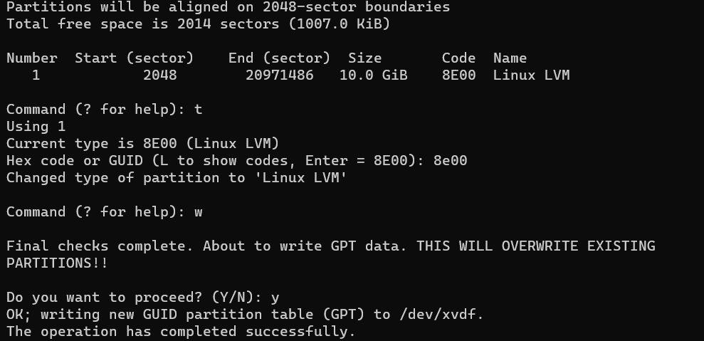
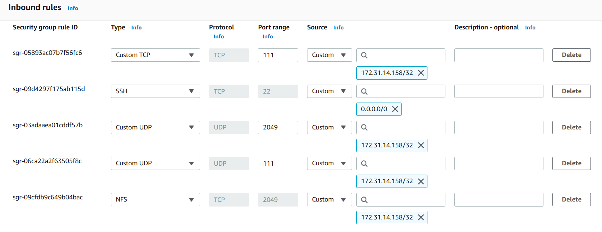
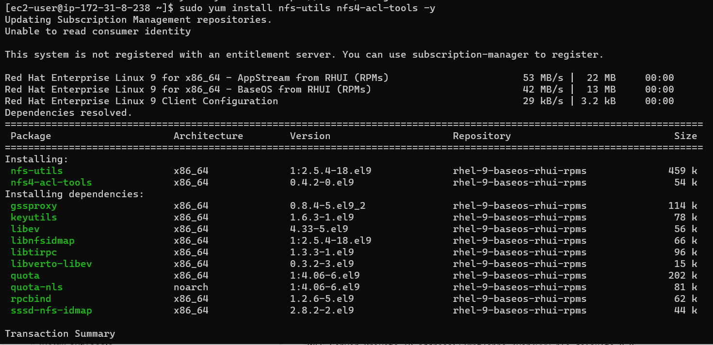
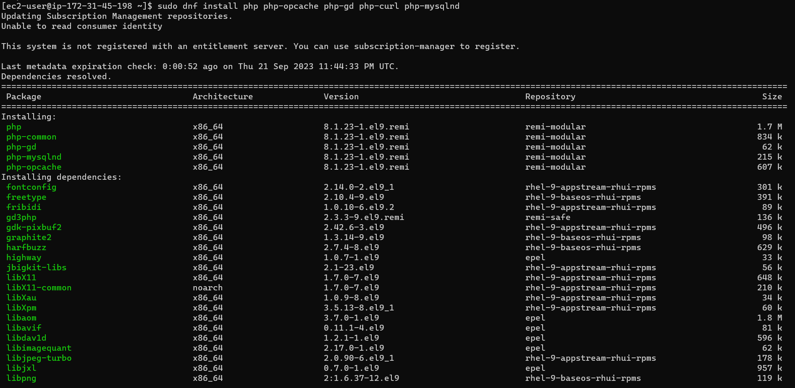

# PROJECT 7: DEVOPS TOOLING WEBSITE SOLUTION

## STEP 1 – PREPARE NFS SERVER

### Spin up a new EC2 instance with RHEL Linux 8 Operating System.

### Based on your LVM experience from Project 6, Configure LVM on the Server.





```
sudo pvcreate /dev/xvdf1
sudo pvcreate /dev/xvdg1
sudo pvcreate /dev/xvdh1
```


### Instead of formating the disks as ext4, I will format them as xfs

```
sudo mkfs.xfs -f /dev/xvdf
sudo mkfs.xfs -f /dev/xvdg
sudo mkfs.xfs -f /dev/xvdh
```


### Ensure there are 3 Logical Volumes. lv-opt lv-apps, and lv-logs

```
sudo lvcreate -n lv-opt -L 9G webdata-vg
sudo lvcreate -n lv-apps -L 9G webdata-vg
sudo lvcreate -n lv-logs -L 9G webdata-vg
```
`sudo lvs`


```
sudo mkfs.xfs -f /dev/webdata-vg/lv-opt
sudo mkfs.xfs -f /dev/webdata-vg/lv-apps
sudo mkfs.xfs -f /dev/webdata-vg/lv-logs
```


### Create mount points on /mnt directory for the logical volumes as follow:

- Mount lv-apps on /mnt/apps – To be used by webservers
- Mount lv-logs on /mnt/logs – To be used by webserver logs
- Mount lv-opt on /mnt/opt – To be used by Jenkins server in Project 8

```
sudo mkdir -p /mnt/apps
sudo mount /dev/webdata-vg/lv-apps /mnt/apps
```

```
sudo mkdir -p /mnt/logs
sudo mount /dev/webdata-vg/lv-logs /mnt/logs
```

```
sudo mkdir -p /mnt/opt
sudo mount /dev/webdata-vg/lv-opt /mnt/opt
```


### Install NFS server, configure it to start on reboot and make sure it is up and running

```
sudo yum -y update
sudo yum install nfs-utils -y
sudo systemctl start nfs-server.service
sudo systemctl enable nfs-server.service
sudo systemctl status nfs-server.service
```


### Export the mounts for webservers’ subnet cidr to connect as clients. For simplicity, I will install all three Web Servers inside the same subnet, but in production set up I would probably want to separate each tier inside its own subnet for higher level of security.

### To check subnet cidr – I will open EC2 details in AWS web console and locate ‘Networking’ tab and open a Subnet link:

### Making sure I set up permission that will allow my Web servers to read, write and execute files on NFS:

```
sudo chown -R nobody: /mnt/apps
sudo chown -R nobody: /mnt/logs
sudo chown -R nobody: /mnt/opt

sudo chmod -R 777 /mnt/apps
sudo chmod -R 777 /mnt/logs
sudo chmod -R 777 /mnt/opt

sudo systemctl restart nfs-server.service
```


### Configuring access to NFS for clients within the same subnet (example of Subnet CIDR – 172.31.32.0/20 ):

```
sudo vi /etc/exports

/mnt/apps <Subnet-CIDR>(rw,sync,no_all_squash,no_root_squash)
/mnt/logs <Subnet-CIDR>(rw,sync,no_all_squash,no_root_squash)
/mnt/opt <Subnet-CIDR>(rw,sync,no_all_squash,no_root_squash)

Esc + :wq!

sudo exportfs -arv
```

### To check which port is used by NFS and open it using Security Groups (add new Inbound Rule)
`rpcinfo -p | grep nfs`


## Important note: In order for NFS server to be accessible from the client, I must also open following ports: TCP 111, UDP 111, UDP 2049


## STEP 2 — CONFIGURE THE DATABASE SERVER

### Install MySQL server
`sudo apt update`


`sudo apt install mysql-server`


### To configure MySQL server to allow connections from remote hosts.

`sudo vi /etc/mysql/mysql.conf.d/mysqld.cnf`


### Create a database and name it 'tooling'
`sudo mysql`
`CREATE DATABASE tooling;`


### Create a database user and name it 'webaccess'
`CREATE USER 'webaccess'@'172.31.0.0/20' IDENTIFIED BY 'webaccess';`


### Grant permission to webaccess user on tooling database to do anything only from the webservers subnet cidr
`GRANT ALL ON tooling.* TO 'webaccess'@'172.31.0.0/20';`
`FLUSH PRIVILEGES;`
`SHOW DATABASES;`


## Step 3 — Prepare the Web Servers

### We need to make sure that our Web Servers can serve the same content from shared storage solutions, in our case – NFS Server and MySQL database.
### You already know that one DB can be accessed for reads and writes by multiple clients. For storing shared files that our Web Servers will use – we will utilize NFS and mount previously created Logical Volume lv-apps to the folder where Apache stores files to be served to the users (/var/www).

### This approach will make our Web Servers stateless, which means we will be able to add new ones or remove them whenever we need, and the integrity of the data (in the database and on NFS) will be preserved.

### During the next steps we will do following:

### Configure NFS client (this step must be done on all three servers)
### Deploy a Tooling application to our Web Servers into a shared NFS folder
### Configure the Web Servers to work with a single MySQL database
### 1. Launch a new EC2 instance with RHEL 8 Operating System
### 2. Install NFS client
`sudo yum install nfs-utils nfs4-acl-tools -y`


### 3. Mount /var/www/ and target the NFS server’s export for apps

```
sudo mkdir /var/www
sudo mount -t nfs -o rw,nosuid <NFS-Server-Private-IP-Address>:/mnt/apps /var/www
```

### 4. Verify that NFS was mounted successfully by running df -h.


### To make sure that the changes will persist on Web Server after reboot:

`sudo vi /etc/fstab`

### The following line is added:

`<NFS-Server-Private-IP-Address>:/mnt/apps /var/www nfs defaults 0 0`

### 5. Installing Remi’s repository, Apache and PHP

```
sudo yum install httpd -y

sudo dnf install dnf-utils https://rpms.remirepo.net/enterprise/remi-release-9.rpm

sudo dnf install https://dl.fedoraproject.org/pub/epel/epel-release-latest-9.noarch.rpm

sudo dnf module reset php

sudo dnf module enable php:remi-8.1

sudo dnf install php php-opcache php-gd php-curl php-mysqlnd

sudo systemctl start php-fpm

sudo systemctl enable php-fpm

sudo setsebool -P httpd_execmem 1
```





### Steps 1 to 5 are repeated for 2 other servers.

### 6. We can verify that Apache files and directories are available on the Web Server in /var/www and also on the NFS server in /mnt/apps. If you see the same files – it means NFS is mounted correctly. You can try to create a new file touch test.txt from one server and check if the same file is accessible from other Web Servers.

```
sudo mkdir -p /var/www/test.txt

sudo ls -larth /var/www/
```


### 7. Locate the log folder for Apache on the Web Server and mount it to NFS server’s export for logs. Repeat step №4 to make sure the mount point will persist after reboot.

`sudo vi /etc/fstab`

### add:
`172.31.33.137:/mnt/logs /var/log/httpd`

### 8. Fork the tooling source code from Darey.io Github Account to your Github account.


### 9. Deploy the tooling website’s code to the Webserver. Ensure that the html folder from the repository is deployed to /var/www/html

`git clone https://github.com/Emmanuel-Desouza/tooling.git`


### 10. Update the website’s configuration to connect to the database (in /var/www/html/functions.php file). Apply tooling-db.sql script to my database using this command mysql -h <databse-private-ip> -u <db-username> -p <db-pasword> < tooling-db.sql

`sudo mysql -h 172.31.33.155 -u webaccess -p -D tooling < tooling-db.sql`


### 11. Create in MySQL a new admin user with username: myuser and password: password:

### Change to the tooling directory
### Ensure MySQL client is installed (sudo yum install mysql)
### Connect to the mySQL server from the webserver using the ‘webaccess’ user created earlier and the private IP of the DB server.

`sudo mysql -h 172.31.33.155 -u webaccess -p`


### Open the website in your browser http://<Web-Server-Public-IP-Address-or-Public-DNS-Name>/index.php and make sure you can login into the website with myuser user.


### I have just implemented a web solution for a DevOps team using LAMP stack with remote Database and NFS servers.


